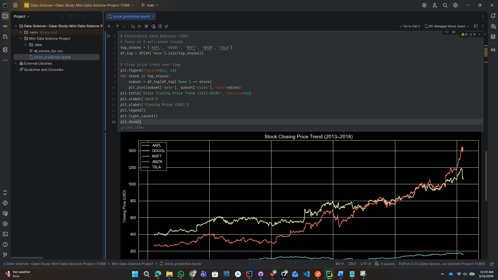
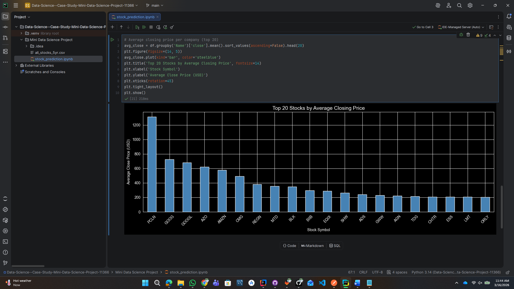
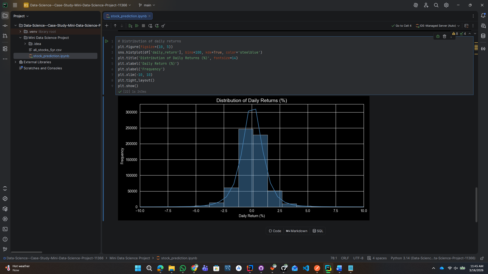
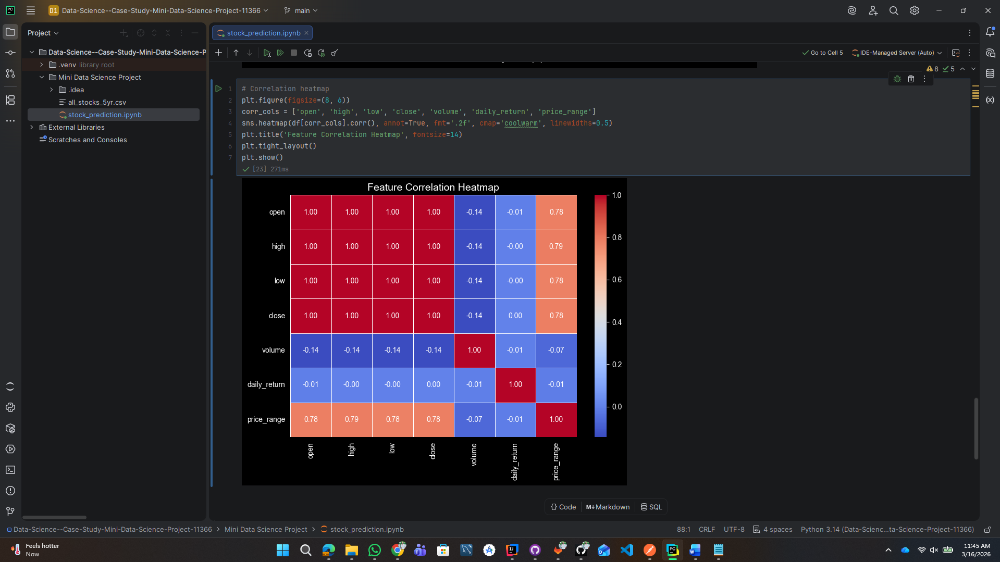
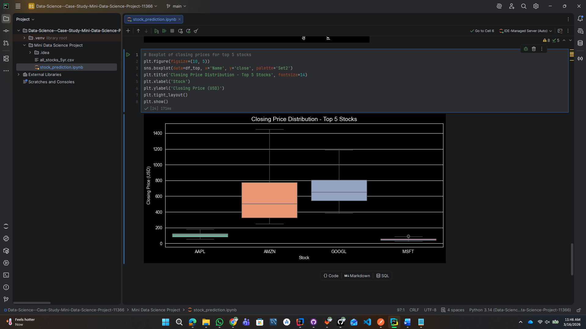
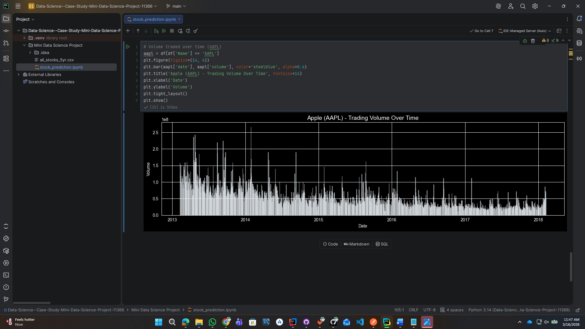
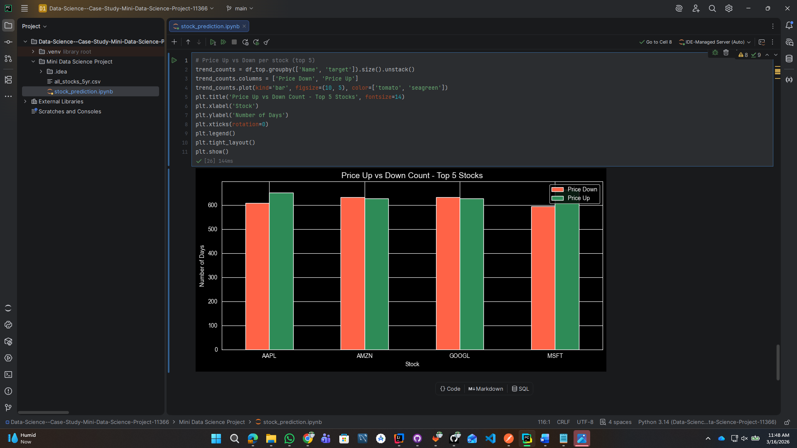
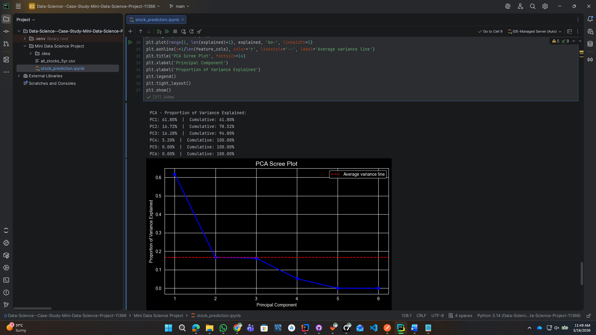
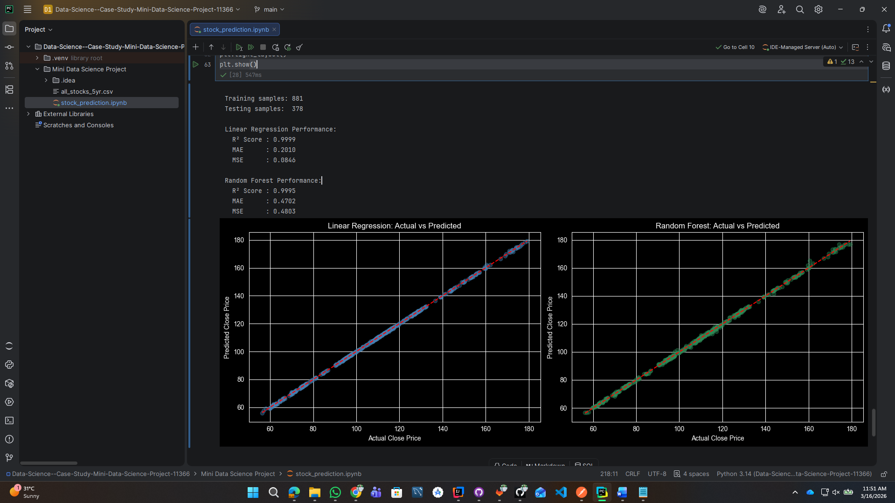
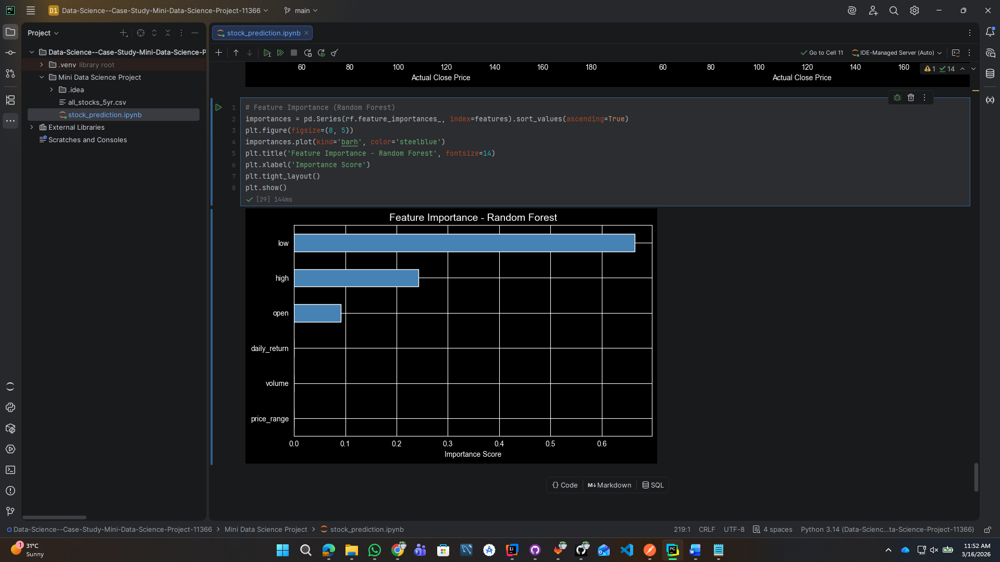

# Stock Price Prediction
## COM4303 - Data Science - Mini Data Science Project

### Research Question
> Can we accurately predict stock closing prices using other market indicators, and how do price trends differ across major S&P 500 companies?

---

## Dataset
- **Source:** [S&P 500 Stock Data — Kaggle](https://kaggle.com/datasets/camnugent/sandp500)
- **File Used:** all_stocks_5yr.csv (US S&P 500 Companies, 2013–2018)
- **Original Rows:** 619,040 entries
- **After Cleaning:** 619,029 unique records
- **Features:** date, open, high, low, close, volume, Name, daily_return, price_range, target

---

## Tools & Libraries

| Tool | Purpose |
|------|---------|
| Python | Programming language |
| Pandas | Data loading and cleaning |
| NumPy | Numerical calculations |
| Matplotlib & Seaborn | Data visualization |
| Scikit-learn | Machine learning models |

---

## Exploratory Data Analysis

### 1. Stock Price Trend Over Time
The closing prices of 5 major stocks (AAPL, GOOGL, MSFT, AMZN, TSLA) showed significant growth between 2013 and 2018. Amazon showed the most dramatic increase, growing from ~$250 to over $1,400.



---

### 2. Top 20 Stocks by Average Closing Price
Amazon (AMZN) had the highest average closing price among all 505 companies, followed by Google (GOOGL), reflecting the dominance of technology companies in the S&P 500.



---

### 3. Distribution of Daily Returns
Daily returns follow a near-normal distribution centered around 0%, confirming that most price movements are small and random, with large movements being rare outliers.



---

### 4. Correlation Heatmap
Open, High, and Low prices show near-perfect correlation (0.99) with closing price. Volume shows weak correlation, confirming it is a poor standalone predictor.



---

### 5. Closing Price Distribution — Top 5 Stocks
Amazon shows the widest price range and highest median, while Apple and Microsoft show tighter distributions with consistent growth.



---

### 6. Apple Trading Volume Over Time
Apple's trading volume was highest in 2013–2014 and gradually declined, suggesting the stock became more stable and less speculative over time.



---

### 7. Price Up vs Down Count
Across all 5 stocks, prices went up slightly more often than down, consistent with the overall bullish market trend during 2013–2018.



---

### 8. PCA Scree Plot
The first 3 principal components explain 94.80% of total variance. PC1 (61.8%) is dominated by price variables (open, high, low), confirming these are the main drivers of market variation.



---

## Machine Learning Models

Two regression models were trained to predict Apple (AAPL) closing prices using a 70/30 train-test split.

### Model Results

| Model | R² Score | Mean Absolute Error | Mean Squared Error |
|-------|:--------:|:-------------------:|:-----------------:|
| Linear Regression | **0.9999** | **0.2010** | **0.0846** |
| Random Forest | 0.9995 | 0.4702 | 0.4803 |

**Linear Regression** was selected as the best model with 99.99% accuracy.

---

### 9. Actual vs Predicted — Linear Regression
Dots cluster perfectly along the diagonal line, confirming near-perfect prediction accuracy.



---

### 10. Actual vs Predicted — Random Forest
Strong clustering along the prediction line, though slightly more scattered than Linear Regression.


---

### 11. Feature Importance — Random Forest
Open price alone accounts for the highest predictive power, followed by High and Low prices. Volume and daily return have minimal importance.



---

## Key Findings
- **Open, High, Low prices** are near-perfect predictors of closing price (correlation = 0.99)
- **Amazon** showed the highest growth (~560%) among all S&P 500 companies over 5 years
- **Daily returns** follow a near-normal distribution — most movements are small and random
- **Volume** has minimal predictive power — contradicting a common trading belief
- **Linear Regression** outperformed Random Forest with R² = 0.9999 and MAE of only $0.20
- **PCA** showed that just 3 components capture 94.80% of all market variation

---

## How to Run

### Requirements
```bash
pip install pandas numpy matplotlib seaborn scikit-learn
```

### Steps
1. Clone this repository
```bash
git clone https://github.com/chanaka-dill/Data-Science--Case-Study-Mini-Data-Science-Project-11366
```
2. Place `all_stocks_5yr.csv` in the same folder as the notebook
3. Open `stock_prediction.ipynb` in Jupyter Notebook or PyCharm
4. Run all cells top to bottom with Shift + Enter

   

---

## Author
Student Name: B.R.C. Dilshan
Student ID: 11366
Submission Date: 17th March 2026
